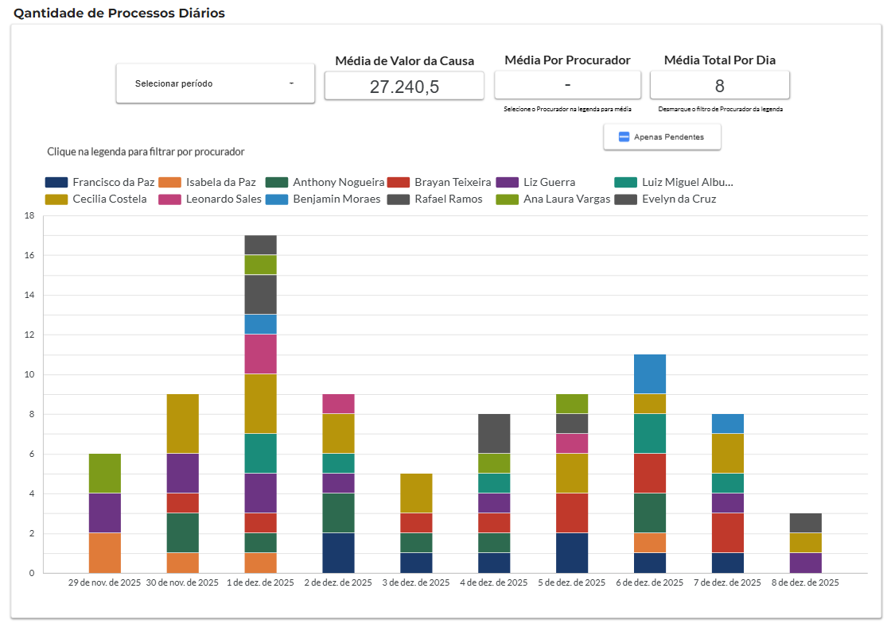
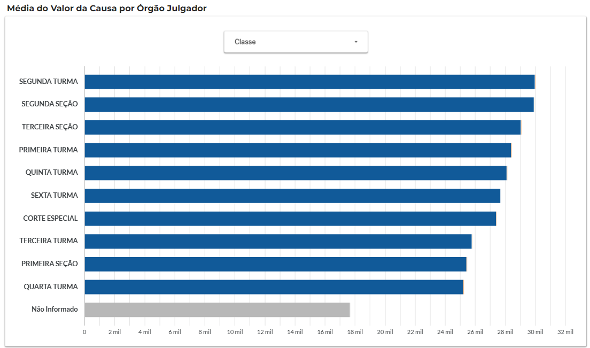
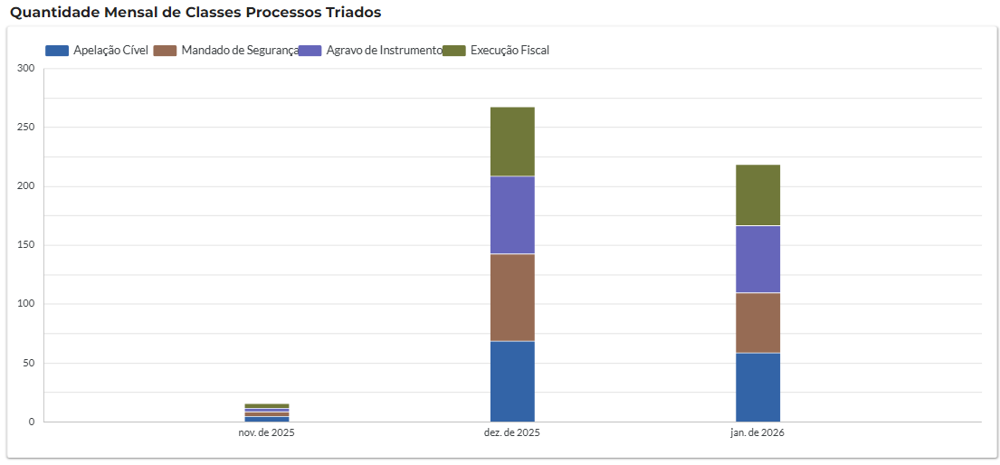
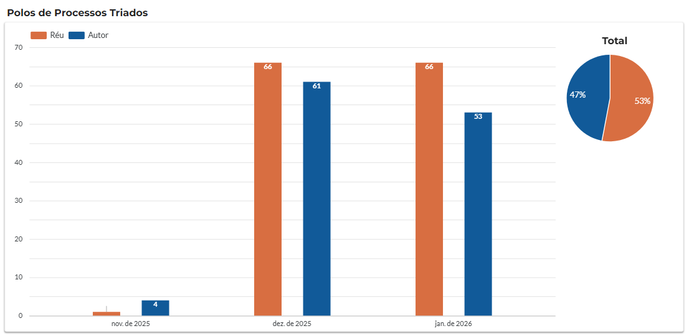
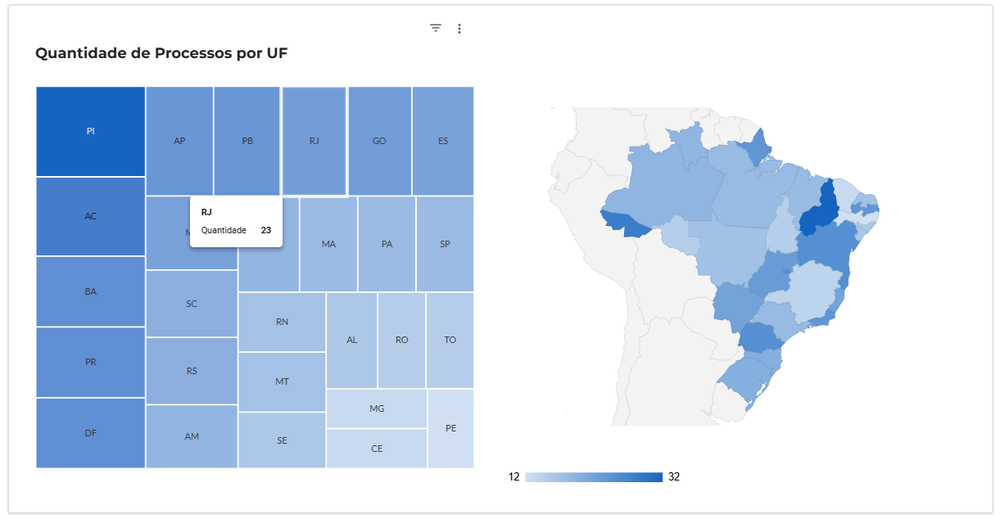

# ⚖️ Pipeline de ETL Jurídico


> 🏛 Pipeline de dados automatizado que simula o ecossistema de Business Intelligence de uma Procuradoria que lida com processos tributários, aplicando **arquitetura Medallion (Bronze/Silver/Gold)** e **modelagem dimensional** para geração de relatórios gerenciais.
---

## 📋 Visão Geral

Este projeto foi desenvolvido para demonstrar habilidades em **Engenharia de Dados** aplicadas ao setor jurídico.  
A partir de dados sintéticos que reproduzem a estrutura real de processos de uma procuradoria, o pipeline realiza:

- Ingestão de dados brutos (**Bronze**)
- Limpeza, padronização e validação (**Silver**)
- Criação de tabelas analíticas e dimensionais otimizadas para dashboards (**Gold**)

Os arquivos finais são exportados nos formatos **CSV** e **Parquet**, prontos para consumo no **Data Studio** ou **Power BI**.

## 🔏 Sobre os Dados

Os dados são gerados sinteticamente pelo script `gerador_mock.py`. As **classes processuais** e **matérias jurídicas** foram extraídas de documentos públicos anônimos, garantindo realismo sem expor informações sigilosas. Os números de processo, nomes de procuradores e valores são fictícios.

--- 
## 🛠️ Tecnologias Utilizadas
- **Python 3.10+**
- **Pandas & Numpy:** Para manipulação de dados de alta performance (Vectorization).
- **Faker:** Para geração de dados sintéticos realistas em pt-BR
- **Loguru:** Para observabilidade e logs estruturados do pipeline
- **Docker:** Conteinerização do pipeline para execução isolada
- **Pytest:** Testes unitários automatizados das transformações
- **Parquet:** Formato colunar para armazenamento eficiente
---

## 🚀 Como Executar

1. **Clone o repositório**
   ```bash
   git clone https://github.com/vini-gm/pipeline-etl-juridico-replica-v1.git
   cd pipeline-etl-juridico-replica-v1  
   ```
2. **Instale as dependências**
   ```bash
   pip install -r requirements.txt
   ```
3. **Execução**
   - Execução Sem Docker:
      - **Gere os dados simulados (Mock)**
        ```bash
         python src/gerador_mock.py
        ```
      - **Rode o Pipeline de ETL**
        ```bash
         python src/pipeline_etl.py
        ```
   - Execução Com Docker:
        ```bash
         docker compose up --build
        ```
---

## 🎯 Objetivos
O pipeline foi desenhado para responder perguntas gerenciais de uma Procuradoria:

| Pergunta                                               | Tabela                  | Visualização                                  |
|--------------------------------------------------------|-------------------------|-----------------------------------------------|
| Qual órgão julgador concentra os processos mais caros? | `base_analitica`        | Barras horizontais por órgão                  |
| Qual procurador tem maior volume diário?               | `performance_procurador` | Barras empilhadas                             |
| Qual a taxa de conclusão por procurador?               | `base_analitica`        | Barras empilhadas                             |
| Qual polo (Autor/Réu) predomina no acervo? | `dim_polo`          | Barras empilhadas                             |
| Qual classe processual domina o acervo?                | `base_analitica`        | Gráfico de Pizza e Barras verticais empilhadas | 
| Em quais UFs há maior concentração de processos?          | `dim_regionalizacao_uf` | Mapa de calor e Mapa de Árvore                |
| Quais matérias jurídicas são mais recorrentes? | `dim_materias`          | Barras Horizontais por matéria      |
---

## 📊 Resultados
O pipeline gera os seguintes arquivos na pasta `data/gold/`, modelados para consumo em Data Studio ou Power BI segundo os princípios de **Modelagem Dimensional (Star Schema)**. As tabelas dimensionais são geradas para alimentar gráficos específicos, seguindo um modelo Star Schema simplificado. A tabela fato (base_analitica) contém os principais atributos dos processos, enquanto as dimensões (dim_materias, dim_regionalizacao_uf, etc.) oferecem visões agregadas e normalizadas para os dashboards.:
> 💡 Além do CSV tradicional, cada tabela também é exportada em **Parquet** para armazenamento colunar e eficiência em leituras futuras para big data.

### 1. Tabela Fato
* **`base_analitica.csv / .parquet`**: Consolidação final dos processos com dados limpos.
    * *Tratamentos:* Valores monetários convertidos, datas em ISO-8601, órgãos julgadores padronizados

### 2. Tabelas Dimensionais & Agregadas
* **`performance_procurador.csv / .parquet`**: produtividade diária por procurador.
    * **Cross Join** entre calendário de dias úteis e lista de procuradores garante que dias com zero processos apareçam nos gráficos temporais.
* **`dim_materias.csv / .parquet`**: granularidade por matéria jurídica.
    * Uso de **`explode()`** para transformar listas de códigos separados por  quebra de linha `\n` e recombinação de código com assunto.
* **`dim_regionalizacao_uf.csv / .parquet`**: Normalização geográfica.
    * Uso de **`melt()`** para transformar colunas de múltiplos estados (`UF_1`, `UF_2`) em uma estrutura vertical para mapas de calor.
* **`dim_polo.csv / .parquet`**: Processos onde a Procuradoria atua como Autor ou Réu.

---
## 📁 Estrutura do Projeto
``` graph
pipeline-juridico-v1/
├── src/
│   ├── gerador_mock.py           # Geração dos dados sintéticos (Bronze)
│   └── pipeline_etl.py           # Pipeline ETL (Bronze → Silver → Gold)
├── tests/                        # Testes unitários
│   └── test_pipeline.py
├── data/                         # Camadas de dados (geradas, não versionadas exceto referencias)
│   ├── referencias/              # Domínios estáticos (versionados)
│   │   ├── classes.csv
│   │   └── materias.csv
│   ├── bronze/                   # Dados brutos (mock)
│   │   └── dados_brutos_simulados.csv
│   ├── silver/                   # Base limpa intermediária
│   │   └── base_limpa.csv
│   └── gold/                     # Tabelas finais (fato e dimensões)
│       ├── base_analitica.csv / .parquet
│       ├── dim_materias.csv / .parquet
│       ├── dim_regionalizacao_uf.csv / .parquet
│       ├── dim_polo.csv / .parquet
│       └── performance_procurador.csv / .parquet
├── logs/                         # Logs de execução (gerados, persistidos via volume)
│   └── pipeline.log
├── images/                       # Screenshots do dashboard (versionados)
│   ├── grafico-processos-diários.png
│   ├── grafico-classes-triadas.png
│   ├──  grafico-polo-processual.png
│   ├── grafico-orgao-julgador-valor.png
│   ├── grafico-materias-recorrentes.png
│   └── grafico-mapa-calor-processos.png
├── Dockerfile
├── docker-compose.yml
├── requirements.txt
└── README.md
```
---

## 🏛️ Arquitetura Medalhão
| **Camada**   | 	  **Descrição**	                                                                    | **Pasta**              |
|:-------------|:-------------------------------------------------------------------------------------|:-----------------------|
| Bronze       | 	Dados crus, imutáveis, exatamente como gerados pelo mock                            | ``data/bronze/``	    |
| Silver       | Dados padronizados, limpos, validados após transformações. exportado automaticamente | ``data/silver/``       |
| Gold	        | Tabelas modeladas fato e dimensões), prontas para consumo em BI                      | ``data/gold/``         | 
| Referências	| Catálogo de domínio (classes processuais e matérias jurídicas)                       | ``data/referencias/``  |

---

## 🧩 Modelagem Híbrida (OBT + Star Schema)

O pipeline adota uma estratégia mista para otimizar o consumo no Data Studio:

- A **tabela fato** (`base_analitica`) armazena os atributos mais usados, evitando joins pesados.
- As **dimensões** (`dim_materias`, `dim_regionalizacao_uf`, `dim_polo`) são geradas separadamente para análises específicas, com granularidade adequada.

Dessa forma, unimos a simplicidade de uma **One Big Table (OBT)** para a visão principal e a flexibilidade do **Star Schema** para os detalhamentos, sem sobrecarregar o dashboard com relacionamentos complexos.

## 📈 Dashboard Jurídico: Data Studio 
Visualização interativa dos relatórios gerados pelo pipeline:
- 👉[Dashboard Jurídico – Data Studio](https://datastudio.google.com/u/0/reporting/5f41065d-4da6-4fbf-9e82-917f8bc6143a/page/AykmF/)

Aaixo estão algumas visualizações geradas a partir dos dados processados pelo pipeline:

| Gráfico                         | Preview                                                       |
|---------------------------------|---------------------------------------------------------------|
| Processos Diários               |     |
| Órgãos com processos mais caros |  |
| Classes Triadas                 |         |
| Polo                            |                    |
| Distribuição por UF             |   |
| Matérias mais recorrentes       |                   |

---

## 🧪 Testes
Os testes unitários cobrem as principais transformações do pipeline:
- Conversão de valores monetários (R$ 1.000,00 → 1000.0)
- Padronização de órgãos julgadores (1T → PRIMEIRA TURMA)
- Combinação de códigos e assuntos em strings legíveis

Execute com:
```bash
    python -m pytest tests/ -v
```
---

## 🚧 Extensões Futuras

- Orquestração com Apache Airflow para execução agendada
- Migração da camada Gold para um Data Warehouse (PostgreSQL/BigQuery)
- Testes de integração com validação de schema (Great Expectations)
- CI/CD com GitHub Actions para build automatizado do Docker e testes